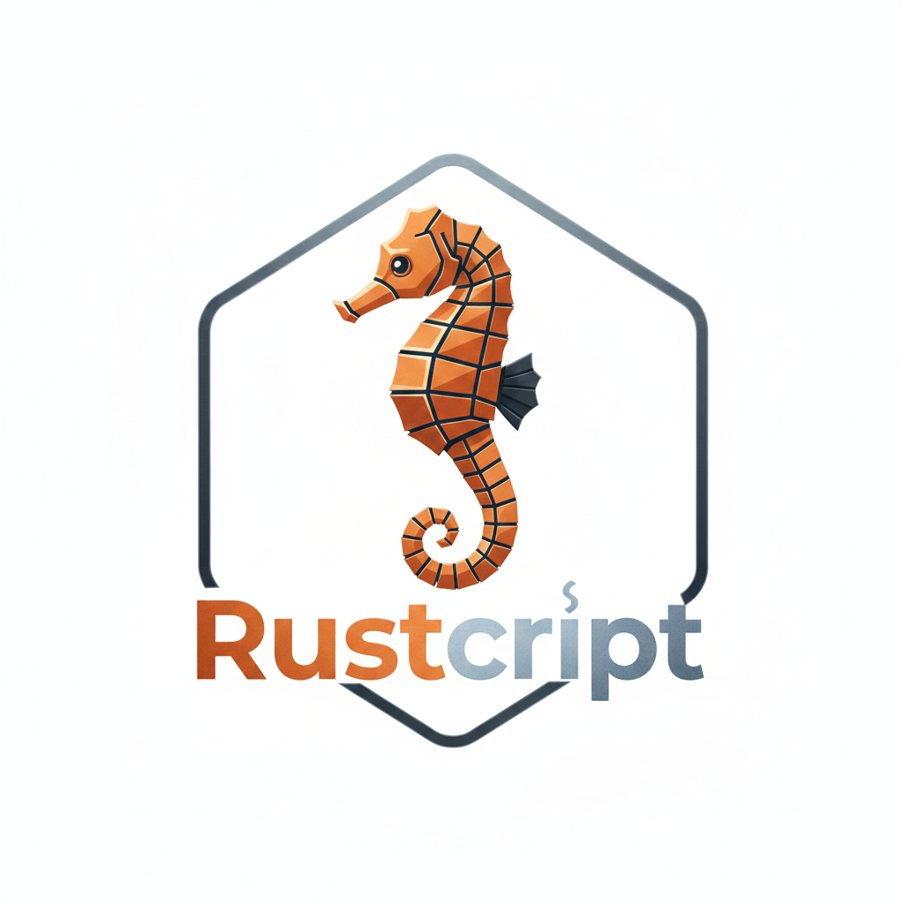

<p align="center">
  
</p>

---


# The Rustcript Language Manual

This document provides a comprehensive guide to the language's syntax, features, standard library, and integration with Rust applications.

## Table of Contents
1.  [Getting Started](#1-getting-started)
2.  [Variables & Types](#2-variables--types)
3.  [Operators](#3-operators)
4.  [Control Flow](#4-control-flow)
5.  [Loops](#5-loops)
6.  [Functions](#6-functions)
7.  [Complex Data Structures](#7-complex-data-structures)
8.  [Modules & Imports](#8-modules--imports)
9.  [Standard Library](#9-standard-library)
10. [Host Integration (For Rust Devs)](#10-host-integration-for-rust-devs)
11. [Security](#11-security)
12. [Testing the Interpreter](#12-testing-the-interpreter)
13. [Compilation & Integration](#13-compilation--integration)

---

## 1. Getting Started

A Rustcript program is a simple text file with a `.rc` extension. The interpreter executes commands line by line. Comments start with `#`.

### 1.1. Your First Script: Hello, World!

The `print` command outputs text. The value must be a string literal, enclosed in single `'` or triple `'''` quotes.

```rust
# /examples/01_basics.rc
print 'Hello, rustcript!'
```

### 1.2. Running Scripts

The interpreter is executed from the command line.

```bash
./target/release/rustcript path/to/your_script.rc
```

### 1.3. Command-Line Arguments

You can control the interpreter's behavior with the following flags:

| Flag                  | Argument | Description                                                                                             |
| :-------------------- | :------- | :------------------------------------------------------------------------------------------------------ |
| `--limit`             | `<N>`    | Sets a maximum instruction limit to `N`. The script will abort if it exceeds this, preventing infinite loops. |
| `--unlimited`         | (None)   | Disables the instruction limit entirely. Use with caution.                                              |
| `--sandbox`           | `<PATH>` | **(Requires `file_io` feature)** Enables the `io` module and restricts all file operations to the specified directory path. |
| `--allow-read`        | (None)   | **(Requires `file_io` feature)** Grants permission for `io.read` and `io.exists`.                       |
| `--allow-write`       | (None)   | **(Requires `file_io` feature)** Grants permission for `io.write` and `io.append`.                      |
| `--allow-delete`      | (None)   | **(Requires `file_io` feature)** Grants permission for `io.delete`.                                     |
| `--unsafe-no-sandbox` | (None)   | **(Requires `file_io` feature)** Disables sandbox protection, allowing I/O on the entire host filesystem. **Use with extreme caution.** |
| `--help`              | (None)   | Displays the help message with all available options.                                                   |

**Example:**
```bash
# Run a script that can read and write files inside the './data' folder
./target/release/rustcript --sandbox ./data --allow-read --allow-write file_processor.rc
```

---

## 2. Variables & Types

Rustcript is strongly and dynamically typed. Variables are created upon first assignment.

### 2.1. Type System

| Type      | Syntax                    | Description                                       | Example                          |
| :-------- | :------------------------ | :------------------------------------------------ | :------------------------------- |
| **Integer** | `123`                     | 32-bit signed integer.                            | `score = 100`                    |
| **Float**   | `3.14`                    | 64-bit floating-point number.                     | `pi = 3.14159`                   |
| **Boolean** | `true` or `false`         | A logical value.                                  | `is_active = true`               |
| **String**  | `'text'` or `'''text'''`  | A sequence of characters. Must be quoted.         | `name = 'Alice'`                 |
| **Time**    | (Generated via `time`)   | A high-precision timestamp.                       | `time start_time`                |
| **Tuple**   | `('A', 1)`                | Fixed-size, ordered collection of mixed types.    | `point = (10, 20, 'origin')`     |
| **Vector**  | `{1, 2}` or `[1, 2]`      | Dynamic, ordered list of mixed types.             | `items = {'sword', 10, true}`    |
| **HashMap** | `{'key': 'val'}`          | A collection of key-value pairs.                  | `user = {'id': 123, 'tag': 'vip'}`|
| **Function**| (Reference by name)       | A reference to a defined function.                | `op = my_func`                   |
| **UserData**| (Injected by Host)        | A native, thread-safe Rust object.                | `player = create_player()`       |

### 2.2. Variable Declaration & Scoping

| Declaration      | Scope    | Behavior                                                                                       |
| :--------------- | :------- | :--------------------------------------------------------------------------------------------- |
| `v = 10`         | **Auto** | Updates local if it exists, else updates global if it exists, else creates a new **local**.     |
| `var v = 10`     | **Local**| Always creates or updates a variable in the current function's scope.                          |
| `global v = 10`  | **Global**| Always creates or updates a variable in the global scope, visible everywhere.                  |

### 2.3. Input and Output

- **`print`**: Displays output. It supports variable interpolation using `{variable_name}` inside the string.
- **`input`**: Pauses execution and waits for the user to enter a line of text, which is then stored in a variable.

```rust
print '--- User Profile ---'
print 'Please enter your name:'
input user_name

print 'Welcome, {user_name}!'

print 'Enter your age:'
input age # Input parser will try to convert '25' to an Integer

age_next_year age + 1
print 'Next year you will be {age_next_year}.'
```

---

## 3. Operators

| Category     | Operators                  | Notes                                                     |
| :----------- | :------------------------- | :-------------------------------------------------------- |
| **Arithmetic**| `+`, `-`, `*`, `/`, `%`    | `+` also concatenates strings.                            |
| **Assignment**| `=`, `+=`, `-=`, `*=`, `/=`| Modifies a variable's value.                            |
| **Comparison**| `==`, `!=`, `>`, `<`, `>=`, `<=` | Works on numbers, strings, and time values. |
| **Logic**       | `&&`, `||`, `!`            | Used in conditional statements. `!var` inverts boolean value. |

```rust
score = 100
score += 50 # score is now 150

message = 'Hello' + ', ' + 'World!' # message is 'Hello, World!'

is_ready = true
can_proceed score > 100 && is_ready # can_proceed is true
```

---

## 4. Control Flow

### 4.1. `if / else_if / else`

Executes blocks of code conditionally. Blocks are defined by `[` and `]`.

```rust
power_level = 9500

if power_level > 9000 [
    print 'Its over 9000!'
] else_if power_level > 5000 [
    print 'Its a decent power level.'
] else [
    print 'Power level is low.'
]
```

### 4.2. `match`

A clean alternative to a chain of `if` statements when checking a variable against multiple constant values.

```rust
status_code = 404
match status_code [
    case 200 [
        print 'Success (OK)'
    ]
    case 404 [
        print 'Error (Not Found)'
    ]
    default [
        print 'Unknown Status'
    ]
]
```

### 4.3. `try / catch`

Handles runtime errors gracefully. If an error occurs in the `try` block, execution jumps to the `catch` block, and the error message is stored in the global `LAST_ERROR` variable.

```rust
items = {10, 20}

try [
    print 'Attempting to access a non-existent index...'
    invalid = items.5 # This will cause an error
] catch [
    print 'Caught an error as expected!'
    print 'Error message: {LAST_ERROR}'
]

print 'Execution continues after the catch block.'
```

---

## 5. Loops

### 5.1. `while` loop

Repeats a block as long as a condition is true.

```rust
count = 3
while count > 0 [
    print 'Countdown: {count}'
    count -= 1
]
print 'Liftoff!'
```

### 5.2. `for` loop

Repeats a block for a numerical range. The loop variable is automatically created and incremented.

```rust
# Loops from 1 up to (and including) 3
for i 1 4 [
    print 'Loop iteration: {i}'
]
```

### 5.3. `foreach` loop

Iterates over the elements of a Vector or the keys of a HashMap.

```rust
# Vector iteration
fruits = {'apple', 'banana', 'cherry'}
foreach fruit in fruits [
    print 'I have a(n) {fruit}.'
]

# HashMap iteration
capitals = {'USA': 'Washington D.C.', 'France': 'Paris'}
foreach country in capitals [
    capital = capitals.get(country)
    print 'The capital of {country} is {capital}.'
]
```

### 5.4. `loop` and `break`

The `loop` command creates an infinite loop. Use `break` to exit any loop (`while`, `for`, `foreach`, `loop`).

```rust
loop [
    print 'Enter a command (type "exit" to quit):'
    input cmd
    if cmd == 'exit' [
        break
    ]
    print 'You typed: {cmd}'
]
print 'Exited loop.'
```

---

## 6. Functions

### 6.1. Modern Functions (Preferred)

Use the `function` keyword to define reusable blocks of code with parameters and return values. Functions have isolated local scopes, preventing variables from leaking out.

```rust
# Define a function to add two numbers
function add a b [
    sum a + b
    return sum # Return the result
]

# Call the function
result = add(15, 27)
print '15 + 27 = {result}'

# Demonstrate scope isolation
x = 100
function scope_test [
    var x = 5 # This 'x' is local and shadows the global one
    print '  -> Inside function, x is {x}'
]
scope_test()
print 'After function, global x is still {x}'
```

### 6.2. First-Class Functions (Higher-Order)

In Rustcript, functions are "first-class citizens." This means they can be treated like any other value: stored in variables, passed as arguments to other functions, and even stored in data structures. This enables powerful programming patterns.

```rust
# 1. Assign a function to a variable
function multiply a b [ res a * b; return res ]
my_op = multiply
result = my_op(10, 5) # result is 50
print 'Result from variable call: {result}'

# 2. Pass a function as an argument to a higher-order function
function process_list items processor_func [
    new_list = {}
    foreach item in items [
        # Call the function that was passed in
        processed_item = processor_func(item)
        method new_list.push(processed_item)
    ]
    return new_list
]

function square_it x [ res x * x; return res ]
numbers = {2, 4, 6}
squared_numbers = process_list(numbers, square_it)
print 'Squared numbers: {squared_numbers}'

# 3. Store functions in a HashMap
ops = {'sq': square_it, 'mult': multiply}
selected_op = ops.sq
res = selected_op(9) # res is 81
print 'Result from map: {res}'
```

### 6.3. Legacy Flow Control (Subroutines)

For simpler GOSUB-style logic, you can use labels with `call` and `return`. This also creates a new scope.

```rust
label main
    print 'In main, about to call subroutine...'
    call my_sub
    print 'Back in main.'
    goto end

label my_sub
    print '  -> Inside subroutine.'
    return

label end
```

---

## 7. Complex Data Structures

### 7.1. Creation & Access

```rust
# Vector
permissions = {'read', 'write'}

# HashMap
user = {
    'id': 42,
    'name': 'Alice',
    'permissions': permissions # Nesting is allowed
}

# Accessing data
print 'User Name: {user.name}'
print 'First Permission: {user.permissions.0}'

# Syntactic sugar for access
name = user['name']
perm = permissions[0]
print 'Name (sugar): {name}'
print 'Perm (sugar): {perm}'
```

### 7.2. Modification

You can modify elements directly using assignment.

```rust
items = {10, 20, 30}
print 'Original: {items}'

# Modify via dot notation index
items.1 = 99
print 'Modified .1: {items}'

# Modify via bracket notation index
items[2] = 77
print 'Modified [2]: {items}'

# Modify HashMap
user = {'status': 'active'}
user.status = 'inactive'
user['login_attempts'] = 3
print 'User: {user}'
```

---

## 8. Modules & Imports

Split your code into multiple files for better organization.

### 8.1. Basic Import

The `import` command executes another script's contents in place. The interpreter ensures a file is only ever imported once to prevent cycles.

**`utils.rc`**
```rust
print '[utils.rc] Loading utilities...'
global PI = 3.14159
```

**`main.rc`**
```rust
print '--- Main Script ---'
import 'utils.rc'
print 'The value of PI is {PI}.'
```

### 8.2. Namespaced Import

To avoid naming conflicts, import a file with an alias. This wraps all its global variables and functions in a namespace.

**`math_lib.rc`**
```rust
# Defines a variable and a function
global VERSION = '1.0'
function add a b [
    # Note: Three-address code style for arithmetic
    result a + b
    return result
]
```

**`main.rc`**
```rust
import 'math_lib.rc' as Math

# Access namespaced variable
print 'Math Library Version: {Math.VERSION}'

# Call namespaced function
# Syntax is Namespace.Function(args)
result = Math.add(5, 3)
print 'Sum from lib: {result}'
```

---

## 9. Standard Library

Methods are called using natural `object.method()` syntax. Static modules are called with `Module.function()`. The `method` keyword is used for calls that don't assign a return value.

### 9.1. Vector Methods

| Method               | Example                                   | Description                                      |
| :------------------- | :---------------------------------------- | :----------------------------------------------- |
| `.push(val)`         | `method v.push(40)`                       | Appends an element to the end.                   |
| `.pop()`             | `x = v.pop()`                             | Removes and returns the last element.            |
| `.insert(idx, val)`  | `method v.insert(1, 99)`                  | Inserts `val` at `idx`.                          |
| `.remove(idx)`       | `x = v.remove(0)`                         | Removes and returns the element at `idx`.        |
| `.len()`             | `l = v.len()`                             | Returns the number of elements.                  |
| `.get(idx)`          | `x = v.get(0)`                            | Returns the element at `idx`.                    |
| `.join(sep)`         | `s = v.join(', ')`                        | Joins elements into a string with a separator.   |
| `.shuffle()`         | `method v.shuffle()`                      | Randomizes the element order in-place.           |
| `.clear()`           | `method v.clear()`                        | Removes all elements.                            |

### 9.2. HashMap Methods

| Method               | Example                                   | Description                               |
| :------------------- | :---------------------------------------- | :---------------------------------------- |
| `.insert(key, val)`  | `method m.insert('c', 3)`                 | Adds or updates a key-value pair.         |
| `.remove(key)`       | `x = m.remove('a')`                       | Removes a key and returns its value.      |
| `.get(key)`          | `x = m.get('b')`                          | Returns the value for a given key.        |
| `.keys()`            | `k = m.keys()`                            | Returns a Vector of all keys.             |
| `.len()`             | `l = m.len()`                             | Returns the number of key-value pairs.    |
| `.contains(key)`     | `ok = m.contains('b')`                    | Returns `true` if the key exists.         |

### 9.3. String Methods

| Method                 | Example                                       | Description                                       |
| :--------------------- | :-------------------------------------------- | :------------------------------------------------ |
| `.len()`               | `l = s.len()`                                 | Returns the character count.                      |
| `.to_upper()`          | `u = s.to_upper()`                            | Returns uppercase version.                        |
| `.to_lower()`          | `l = s.to_lower()`                            | Returns lowercase version.                        |
| `.trim()`              | `t = s.trim()`                                | Removes whitespace from both ends.                |
| `.replace(from, to)`   | `n = s.replace(' ', '_')`                     | Replaces all occurrences of a substring.          |
| `.split(sep)`          | `v = s.split(',')`                            | Splits the string into a Vector.                  |
| `.contains(sub)`       | `ok = s.contains('scr')`                      | Returns `true` if the substring exists.           |
| `.starts_with(sub)`    | `ok = s.starts_with('Ru')`                    | Checks if the string starts with a substring.     |
| `.ends_with(sub)`      | `ok = s.ends_with('ipt')`                     | Checks if the string ends with a substring.       |
| `.substring(start, end)`|`sub = s.substring(0, 4)`                     | Extracts a slice of the string.                   |
| `.index_of(sub)`       | `i = s.index_of('scr')`                       | Returns the starting index of a substring, or -1. |
| `.to_int()`            | `i = '123'.to_int()`                          | Parses the string to an Integer.                  |
| `.to_float()`          | `f = '3.14'.to_float()`                       | Parses the string to a Float.                     |
| `.is_match(regex)`     | `ok = email.is_match(p)`                      | **(Regex)** Checks if the string matches a pattern. |
| `.find_all(regex)`     | `v = log.find_all('Error: \d+')`              | **(Regex)** Returns a Vector of all matches.      |
| `.regex_replace(p, r)` | `s = text.regex_replace(p, r)`                | **(Regex)** Replaces all pattern matches.         |

### 9.4. Time Methods

| Method        | Example                         | Description                                            |
| :------------ | :------------------------------ | :----------------------------------------------------- |
| `.date()`     | `d = now.date()`                | Returns date as string "YYYY-MM-DD".                   |
| `.time()`     | `t = now.time()`                | Returns time as string "HH:MM:SS".                     |
| `.elapsed()`  | `e = start.elapsed()`           | Returns seconds (Float) since the time value was created.|
| `.timestamp()`| `ts = now.timestamp()`          | Returns the Unix timestamp (Integer seconds).          |

### 9.5. Static Modules

#### `math` module

| Method             | Example                               |
| :----------------- | :------------------------------------ |
| `math.pi()`        | `p = math.pi()`                       |
| `math.sqrt(n)`     | `r = math.sqrt(25)`                   |
| `math.pow(b, e)`   | `p = math.pow(2, 8)`                  |
| `math.abs(n)`      | `a = math.abs(-50)`                   |
| `math.round(n)`    | `r = math.round(3.6)`                 |
| `math.floor(n)`    | `f = math.floor(3.9)`                 |
| `math.ceil(n)`     | `c = math.ceil(3.1)`                  |
| `math.sin(rad)`    | `s = math.sin(p)`                     |
| `math.cos(rad)`    | `c = math.cos(p)`                     |

#### `rand` module

| Method             | Example                               |
| :----------------- | :------------------------------------ |
| `rand.int(min, max)`|`r = rand.int(1, 101)`                |
| `rand.float()`     | `f = rand.float()`                    |
| `rand.bool()`      | `b = rand.bool()`                     |

#### `json` module

| Method                        | Example                                   |
| :---------------------------- | :---------------------------------------- |
| `json.parse(str)`             | `d = json.parse(json_str)`                |
| `json.stringify(val, [pretty])`|`s = json.stringify(data, true)`          |

#### `os` module (**Feature-Gated**)

| Method             | Example                               | Description                                      |
| :----------------- | :------------------------------------ | :----------------------------------------------- |
| `os.exec(cmd)`     | `c = os.exec('ls -la')`               | Executes a shell command and returns its exit code.|

#### `io` module (**Feature-Gated**)

| Method                        | Example                                   | Description                                       |
| :---------------------------- | :---------------------------------------- | :------------------------------------------------ |
| `io.read(path)`               | `c = io.read('data.txt')`                 | Reads the entire content of a file into a string. |
| `io.write(path, content)`     | `method io.write('log.txt', 'entry')`     | Writes a string to a file, overwriting it.        |
| `io.append(path, content)`    | `method io.append('log.txt', 'entry')`    | Appends a string to the end of a file.            |
| `io.exists(path)`             | `ok = io.exists('config.json')`           | Returns `true` if the file exists.                |
| `io.delete(path)`             | `method io.delete('temp.tmp')`            | Deletes the specified file.                       |

---

## 10. Host Integration (For Rust Devs)

Rustcript is designed to be embedded as a scripting engine in larger Rust applications. The primary way to create a powerful, domain-specific API is by exposing native Rust structs to the script.

### 10.1. The `RustcriptObject` Trait

To make a Rust struct available in Rustcript, implement the `RustcriptObject` trait for it. This trait allows you to define how the script interacts with your object's fields and methods.

```rust
use rustcript::{RustcriptObject, Value};
use std::sync::{Arc, Mutex};

// 1. Your native Rust struct
#[derive(Debug)]
struct GameCharacter {
    name: String,
    hp: i32,
    max_hp: i32,
}

// 2. Implement the trait to define the script API
impl RustcriptObject for GameCharacter {
    fn type_name(&self) -> &str { "GameCharacter" }

    // Handle property access like `player.hp`
    fn get(&self, field: &str) -> Option<Value> {
        match field {
            "name" => Some(Value::String(self.name.clone())),
            "hp" => Some(Value::Integer(self.hp)),
            _ => None,
        }
    }

    // Handle property assignment like `player.hp = 50`
    fn set(&mut self, field: &str, value: Value) -> Result<(), String> {
        match field {
            "hp" => {
                self.hp = value.as_float().unwrap_or(0.0) as i32;
                Ok(())
            },
            _ => Err(format!("Property '{}' is read-only", field)),
        }
    }

    // Handle method calls like `player.heal(20)`
    fn call(&mut self, method: &str, args: Vec<Value>) -> Result<Option<Value>, String> {
        match method {
            "heal" => {
                let amount = args[0].as_float().unwrap_or(0.0) as i32;
                self.hp = (self.hp + amount).min(self.max_hp);
                Ok(Some(Value::Integer(self.hp))) // Return the new HP
            },
            _ => Err(format!("Method '{}' not found", method)),
        }
    }
}
```

### 10.2. Embedding the Interpreter

Once your object implements the trait, you can inject it into the interpreter's global scope.

```rust
use rustcript::{Interpreter, ScriptHandler, Value};
use std::sync::{Arc, Mutex};
// Assume GameCharacter and RustcriptObject impl are defined above

// A minimal handler for your application
struct AppHandler;
impl ScriptHandler for AppHandler { /* ... stubs for print/input/command ... */ }

fn main() {
    // 3. Create an instance of your object
    let character = GameCharacter { name: "Hero".to_string(), hp: 50, max_hp: 100 };

    // 4. Wrap it in a thread-safe Value and inject it
    let character_val = Value::UserData(Arc::new(Mutex::new(character)));

    let script_source = "
        print 'Player HP before: {player.hp}'
        # Script can now call methods you defined!
        player.heal(25)
        print 'Player HP after: {player.hp}'
    ";

    // 5. Create and run the interpreter
    let mut interp = Interpreter::from_source(script_source).unwrap();
    interp.set_global("player", character_val);

    let mut handler = AppHandler;
    interp.run(&mut handler).expect("Script failed!");
}
```

### 10.3. The `ScriptHandler` Trait

For simpler commands that don't require state, you can use the `ScriptHandler` trait's `on_command` method. This is suitable for simple, stateless host functions.

```rust
impl ScriptHandler for AppHandler {
    // ...
    fn on_command(&mut self, command: &str, args: Vec<&str>) -> Result<bool, String> {
        match command {
            "log_message" => {
                println!("[HOST LOG]: {}", args.join(" "));
                Ok(true) // Return true to indicate the command was handled
            }
            _ => Ok(false)
        }
    }
}

// In Rustcript:
// exec log_message This is a test
```

---

## 11. Security

### 11.1. OS Command Execution (`os.exec`)
The ability for a script to execute arbitrary shell commands (`os.exec`) is a significant security risk. For this reason, this functionality is **disabled by default**. To enable it, you must compile the interpreter with the `os_access` feature flag.

```bash
# Build with the feature enabled
cargo build --release --features os_access
```
If a script calls `os.exec` in a binary that was not compiled with this flag, the interpreter will throw a runtime security violation error and halt.

### 11.2. File I/O (`io` module)
Similar to OS commands, direct file system access is a major security concern. The `io` module is **disabled by default** and must be enabled with the `file_io` feature flag.

```bash
# Build with file I/O enabled
cargo build --release --features file_io
```

When enabled, the host application can grant specific permissions (`read`, `write`, `delete`) and choose to enforce a secure sandbox or allow unsafe access to the host filesystem.

#### I/O Permissions
By default, no I/O operations are allowed. The host must explicitly grant permissions for a script to perform file operations.
- **CLI Flags**: `--allow-read`, `--allow-write`, `--allow-delete`.
- **Library API**: `interpreter.set_io_permissions(...)`.

If a script attempts an operation for which it was not granted permission, a runtime security violation will occur.

#### Sandboxing
By default, even with permissions granted, all file operations are confined to a "sandbox" directory. A script **cannot** access files outside this folder.
- **Path Traversal**: Attempts to use `..` to escape the sandbox are detected and blocked.
- **Absolute Paths**: Are forbidden in sandbox mode.
- **Configuration**:
  - **CLI**: `--sandbox <PATH>`.
  - **Library API**: `interpreter.set_sandbox_root(path)`.

#### Unsafe Mode
For trusted scripts (e.g., admin or build scripts), the sandbox can be disabled entirely with the `--unsafe-no-sandbox` flag. This allows the script to access any file on the host filesystem that the user running the interpreter can access. **This is dangerous and should only be used with fully trusted scripts.**

### 11.3. Execution Limiting (Instruction Counting)
To protect the host application from being frozen by infinite loops or computationally expensive scripts, the interpreter counts every operation. If the count exceeds a pre-defined limit, execution is aborted with an error.

This limit is configurable via:
- **CLI**: `--limit <N>` or `--unlimited` (See [Getting Started](#1-getting-started)).
- **Library API**: `interpreter.set_instruction_limit(N)`.
- **Environment Variable**: `rustcript_MAX_OPS`.

The default limit for the command-line executable is **1,000,000** instructions. When used as a library, the default is unlimited (0) and should be set explicitly by the host application for safety.

---

## 12. Testing the Interpreter
The project includes a comprehensive test suite to ensure correctness and prevent regressions.
### 12.1. Rust Unit & Integration Tests
The core library functionality is tested using standard Rust tests. These verify the parser, the public API, and core language features in a controlled environment.

**To run these tests:**
```bash
cargo test
```

### 12.2. Rustcript-Based Regression Suite
A full suite of `.rc` scripts is provided in the `/examples/` directory. A special script, `tests/test_runner.rc`, acts as an automated test runner that executes all example scripts and verifies they complete without errors. This is an excellent way to test the interpreter end-to-end.

**To run the script-based suite:**
*First, ensure all necessary features are enabled, as the test runner uses both `os.exec` and `io` functions.*
```bash
# Build with the necessary features
cargo build --release --features "os_access file_io"

# Run the test runner script
./target/release/rustcript tests/test_runner.rc
```
The runner will print `PASS` or `FAIL` for each script and provide a final summary.


---


## 13. Compilation & Integration

In a production architecture, Rust acts as the high-performance **Engine** (handling memory, I/O, networking, and heavy computation), while `rustcript` acts as the **Brain** (defining business logic, rules, and dynamic configurations). This section details how to compile and integrate `rustcript` into your applications.

### 13.1. Integration Methods

There are several ways to consume this library in your host project.

#### Method A: Direct Rust Integration via Path (Recommended)
This is the standard Cargo approach, ensuring your project and the library use the exact same compiler version and flags.

**In your host `Cargo.toml`:**
```toml
[dependencies]
# Point directly to the Rustcript source folder
rustcript = { path = "../path/to/rustcript" }
```

#### Method B: Foreign Function Interface (FFI)
For integration with other languages (like Python, C#, C++, Go), you can compile `Rustcript` into a C-compatible dynamic library (`.so`, `.dll`). This requires exposing a C-compatible API with `#[no_mangle]` and `extern "C"` functions and compiling with the `cdylib` crate type. This is an advanced use case requiring careful memory management across the language boundary.

#### Method C: Manual `.rlib` Linking (Advanced)
Use this if you prefer to distribute a pre-compiled binary blob. The host must be compiled with the exact same version of `rustc` that built the `.rlib`.

1.  Compile `Rustcript` as a library: `cargo build --lib --release`.
2.  Copy `target/release/librustcript.rlib` to a `libs/` folder in your host project.
3.  Pass the extern flag when compiling your host:
    ```bash
    rustc src/main.rs --extern rustcript=libs/librustcript.rlib
    ```

### 13.2. Binary Size Optimization

To achieve the smallest possible release binary for your application or FFI library, apply the following optimization profile to your `Cargo.toml`:

```toml
[profile.release]
opt-level = "z"     # Optimize for size ('z' is more aggressive than 's')
lto = true          # Enable Link Time Optimization (removes dead code across crates)
codegen-units = 1   # Compile as a single unit (maximizes optimization, slower build time)
panic = "abort"     # Removes stack unwinding info (saves space, but panics crash immediately)
strip = true        # Automatically strip symbols from the binary (requires Rust 1.59+)
```

---

### 13.3. Usage Example (Data Science Scenario)

**Scenario:** An "Anomaly Detector" for high-frequency sensor data.

*   **The Problem:** We need to detect bad data points. The definition of "bad" changes constantly, so recompiling the Rust binary every time logic changes is inefficient.
*   **The Solution:** We build the data loader in **Rust** (compiled once). We write the detection algorithm in **rustcript** (loaded at runtime).

#### Part A: The Rust Host (The Engine)
This code compiles once. It is responsible for loading the heavy data and accepting a script path from the command line.

**File:** `src/main.rs` (Host Application)
```rust
use rustcript::{Interpreter, ScriptHandler, Value, RustcriptObject, resolve_imports};
use std::env;
use std::process;
use std::sync::{Arc, Mutex};

// 1. Define the Data Container
// This holds the heavy dataset. We want the script to reference it via an API,
// not copy the entire dataset into the script's memory.
#[derive(Debug)]
struct SensorData {
    readings: Vec<f64>,
    outliers_found: Vec<f64>,
}

impl RustcriptObject for SensorData {
    fn type_name(&self) -> &str { "SensorData" }

    // API: Allow script to READ data properties
    fn get(&self, field: &str) -> Option<Value> {
        match field {
            "count" => Some(Value::Integer(self.readings.len() as i32)),
            "all_values" => {
                let vec = self.readings.iter().map(|&f| Value::Float(f)).collect();
                Some(Value::Vector(vec))
            }
            _ => None,
        }
    }

    // API: Allow script to WRITE results back to Rust
    fn call(&mut self, method: &str, args: Vec<Value>) -> Result<Option<Value>, String> {
        match method {
            "mark_outlier" => {
                let val = args[0].as_float().unwrap_or(0.0);
                self.outliers_found.push(val);
                Ok(None)
            },
            _ => Err(format!("Unknown method: {}", method))
        }
    }
}

// 2. Minimal Handler (For print logging)
struct AnalysisHandler;
impl ScriptHandler for AnalysisHandler {
    fn on_print(&mut self, text: &str) { println!("[REPORT]: {}", text); }
    fn on_input(&mut self, _: &str) -> String { String::new() }
    fn on_command(&mut self, _: &str, _: Vec<&str>) -> Result<bool, String> { Ok(true) }
}

fn main() {
    // 3. Get the script filename from Command Line Arguments
    let args: Vec<String> = env::args().collect();
    if args.len() < 2 {
        eprintln!("Usage: {} <path_to_script.rc>", args[0]);
        process::exit(1);
    }
    let script_path = &args[1];

    // 4. Load Data (Simulated)
    let dataset = SensorData {
        readings: vec![10.5, 20.0, 99.9, 12.4, 101.2, 5.5, -50.0],
        outliers_found: Vec::new(),
    };
    let dataset_ref = Arc::new(Mutex::new(dataset));
    let dataset_val = Value::UserData(dataset_ref.clone());

    println!("--- Loading Logic from: {} ---", script_path);

    // 5. Resolve Imports and Read the specified script file
    let source_code = match resolve_imports(script_path) {
        Ok(src) => src,
        Err(e) => {
            eprintln!("Error reading script: {}", e);
            process::exit(1);
        }
    };

    // 6. Initialize and Run the Interpreter
    let mut interp = Interpreter::from_source(&source_code).unwrap();
    interp.set_global("sensor", dataset_val);

    let mut handler = AnalysisHandler;
    if let Err(e) = interp.run(&mut handler) {
        eprintln!("Script Error: {}", e);
    }

    // 7. Access Final Results in Rust
    let final_data = dataset_ref.lock().unwrap();
    println!("--- Final Rust State ---");
    println!("Outliers detected: {:?}", final_data.outliers_found);
}
```

#### Part B: The Rustcript Logic (The Brain)
Because the logic is separated, you can change the detection algorithm instantly by editing the `.rc` file, **without recompiling the Rust binary**.

**Scenario 1: Fixed Threshold Check**
*Goal: Flag anything above 95.0.*
```rust
# scripts/logic_fixed.rc
print 'Running Strategy: FIXED THRESHOLD'

threshold = 95.0
data = sensor.all_values

foreach val in data [
    if val > threshold [
        print 'Alert: {val} exceeds limit.'
        # Call back into Rust to save this
        method sensor.mark_outlier(val)
    ]
]
```

**Scenario 2: Statistical Deviation (Advanced)**
*Goal: Calculate the average of the dataset, then flag anything that deviates significantly.*
```rust
# scripts/logic_stat.rc
print 'Running Strategy: STATISTICAL DEVIATION'

data = sensor.all_values
total = sensor.count
sum = 0.0

# Pass 1: Calculate Average
foreach val in data [ sum += val ]
average sum / total
print 'Computed Average: {average}'

# Pass 2: Detect Deviation
tolerance = 40.0
foreach val in data [
    diff val - average
    method abs_diff = math.abs(diff)

    if abs_diff > tolerance [
        print 'Alert: {val} deviates too far from average.'
        method sensor.mark_outlier(val)
    ]
]
```

### 13.4. Running Different Scenarios
First, ensure your project folder has the scripts:
```text
my_host_project/
├── Cargo.toml
├── src/
│   └── main.rs
├── scripts/
│   ├── logic_fixed.rc
│   └── logic_stat.rc
└── ...
```

Now, run the **same** Rust binary with different behaviors by changing the command line argument.

**Scenario A: Run the Fixed Threshold Logic**
```bash
cargo run -- scripts/logic_fixed.rc
```
**Output:**
```text
--- Loading Logic from: scripts/logic_fixed.rc ---
[REPORT]: Running Strategy: FIXED THRESHOLD
[REPORT]: Alert: 99.9 exceeds limit.
[REPORT]: Alert: 101.2 exceeds limit.
--- Final Rust State ---
Outliers detected: [99.9, 101.2]
```

**Scenario B: Run the Statistical Logic**
```bash
cargo run -- scripts/logic_stat.rc
```
**Output:**
```text
--- Loading Logic from: scripts/logic_stat.rc ---
[REPORT]: Running Strategy: STATISTICAL DEVIATION
[REPORT]: Computed Average: 28.5
[REPORT]: Alert: 99.9 deviates too far from average.
[REPORT]: Alert: 101.2 deviates too far from average.
[REPORT]: Alert: -50 deviates too far from average.
--- Final Rust State ---
Outliers detected: [99.9, 101.2, -50.0]
```

*(Note: The `--` in `cargo run -- <args>` tells Cargo to pass the remaining arguments to your program, not to Cargo itself.)*

---

### 13.5. Deep Dive: How the Interpreter Loads `.rc` Files

The host application (`src/main.rs`) is the bridge between a file on disk and the Rustcript interpreter. The lifecycle follows these stages:

1.  **Argument Parsing (Selection):** Rust inspects command-line arguments to get the target filename.
2.  **Import Resolution (Pre-Processing):** The host calls `rustcript::resolve_imports(path)`. This function is critical: it reads the main script and recursively finds, reads, and injects the content of any `import '...'` statements. The output is a single, unified string of source code.
3.  **Compilation (Parsing):** The unified string is passed to `Interpreter::from_source(src)`. The interpreter parses this text into a ready-to-execute `Program` structure (an Abstract Syntax Tree).
4.  **Execution (Runtime):** The host calls `interp.run(&mut handler)`. The interpreter begins executing the `Program`, calling methods on the provided `handler` for I/O and on any injected `RustcriptObject` instances.
